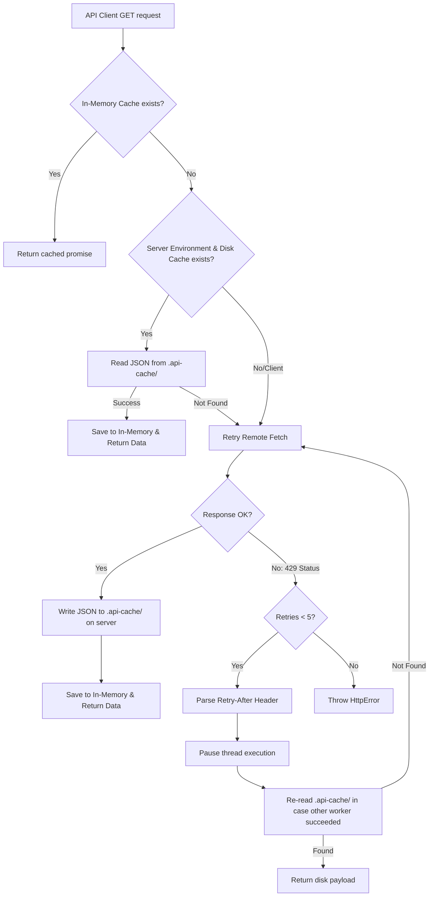

# LuxiArc AstroJS Developer Skill

This document provides a highly detailed, comprehensive map of the LuxiArc project's codebase, layout rules, UI component definitions, feature domains, API client caching architecture, and developer standards. AI coding assistants and human developers MUST follow these guidelines strictly when making modifications.

---

## 1. Project Technology Stack & Core Packages
- **AstroJS (v6)**: Configured in Static Site Generation (SSG) mode. All pages compile to static HTML at build time.
- **TailwindCSS (v4)**: Uses the CSS-first configuration pipeline via `@tailwindcss/vite` plugin.
- **Client Router (`astro:transitions`)**: Leverages `<ClientRouter />` inside layouts to enable smooth SPA-like client-side transitions between HTML files.
- **AOS (Animate On Scroll)**: Triggers visual entry animations (fade-up, fade-left, fade-right) upon scrolling.
- **Swiper (v12)**: Powering slide carousels on the homepage and details sections.
- **TypeScript**: Strict type check rules are enabled to prevent runtime null pointers.

---

## 2. Directory Structure & Path Aliases
To ensure modularity, we use a **Feature-Driven (Domain-Driven)** directory layout:

```text
src/
├── assets/                 # Global static images, design drawings, icons.
├── layouts/                # Main templates wrapping sections.
│   └── Layout.astro        # Base layouts with SEO meta tags, ClientRouter, and AOS initialization.
├── components/             # Shared reusable code.
│   ├── layout/             # Global page blocks (Header.astro, Footer.astro).
│   └── ui/                 # Atomic UI components (Buttons, Images, CLink, Cards).
├── features/               # Domain-specific capsule directories (14 features).
│   ├── home/               # Homepage parts (WhyChooseUs, Testimonials, Solutions).
│   ├── page-statics/       # Layouts of static pages (AboutLayout, ContactLayout).
│   ├── news/               # News, categories list, grids.
│   └── [feature-name]/     # (e.g. costs, services, interior, contractors, finish, etc.)
│       ├── services.ts     # Domain-specific API fetches.
│       └── types.ts        # Type interfaces matching the Laravel JSON output.
├── pages/                  # Router endpoints (URLs). Keep these files extremely thin!
│   ├── index.astro         # Homepage entry point.
│   ├── [slug].astro        # Dynamic static page resolver.
│   ├── api/                # API routes (e.g., clear-cache.ts).
│   └── [feature-folder]/   # Subfolders containing index.astro and [slug].astro for pages.
└── utils/                  # Global helper functions.
    ├── api.ts              # Custom API client with cache/retry handlers.
    └── cn.ts               # Tailwind class merger utility (clsx + tailwind-merge).
```

### Key Import Conventions:
- **Path Alias**: Always import using path alias `@/` pointing directly to the `src/` folder.
- **Examples**:
  - `import { api } from "@/utils/api"`
  - `import Layout from "@/layouts/Layout.astro"`
  - `import { ItemV2 } from "@/components/ui"`
- Never use relative dot nesting (e.g., `../../components/ui/ItemV2.astro`).

---

## 3. Global Shared UI Components (Component Library)
The files inside `src/components/ui/` are standard atomic elements used across different features:

### 3.1. `CImage.astro` (Image Component)
- **Role**: Optimizes dynamic images from local folders or remote URLs, preventing layout shifts (CLS).
- **Props**:
  - `src`: Image path, metadata, or URL string.
  - `alt`: Descriptive alt text (SEO requirement).
  - `class`: Styling classes.
- **Rule**: Never use `` directly; always wrap images in `CImage` or use Astro's native `<Image />`.

### 3.2. `CLink.astro` (Router-Compatible Link)
- **Role**: Handles site navigation. Integrates with Astro's `<ClientRouter />` to ensure seamless transitions without reloading.
- **Props**:
  - `href`: Link target path.
  - `title`: Optional anchor title attribute.
  - `class`: Styling classes.
  - `target`: Standard HTML target (adds `rel="noopener noreferrer"` automatically if `_blank`).

### 3.3. `ItemV1.astro` (Grid Layout Card)
- **Role**: Renders a vertical grid item layout containing an image and a title.
- **Props**: `title: string`, `image: string`, `href: string`.
- **Animations**: Automatically applies `data-aos="fade-up"`.

### 3.4. `ItemV2.astro` (Row Layout Staggered Card)
- **Role**: Renders a horizontal card with an image on one side and a title, description, and link on the other. Used in list indices (e.g., Services list, Materials list).
- **Props**:
  - `title: string`, `description: string`, `image: string | ImageMetadata`, `href: string`.
  - `reverse?: boolean`: If true, places the image on the right and text on the left.
- **Animations**: Staggers AOS entries. Image slides left/right (`fade-left`/`fade-right`) and text slides from the opposite direction based on the `reverse` flag.

### 3.5. `ItemSlider.astro` (Related Swiper Slider Wrapper)
- **Role**: Renders a carousel list of related items (e.g. at the bottom of detail pages).
- **Props**: `items: Array<{ name: string, slug: string, img: string, resource_type: string }>`

### 3.6. Common Layout Blocks
- **`PageBanner.astro`**: Simple top header layout displaying `title` and a background `image`.
- **`PageContent.astro`**: Renders standard WYSIWYG HTML description (`set:html`).
- **`PageDetailContent.astro`**: Styles and structures detailed text contents on individual detail views.
- **`PageIntro.astro`**: Splits descriptions into two columns with asymmetrical scroll slides.

---

## 4. Feature Modules (Detailed API & Routing Mappings)
There are **14 core feature directories** inside `src/features/`. Each feature module matches a specific routing subfolder under `src/pages/`:

| Feature Directory | Description / Page Role | Route / Page Entry Point | API Endpoints Called |
| :--- | :--- | :--- | :--- |
| `home` | Homepage content rendering | `src/pages/index.astro` | `/config/home`, `/display/banners`, `/display/customer-testimonials`, `/display/customer-highlights`, `/display/why-choose-us-items`, `/display/faqs`, `/display/home-process`, `/display/home-solution` |
| `page-statics` | Static info pages (About Us, Contact, Policies) | `src/pages/[slug].astro` | `/page-statics`, `/page-statics/${slug}`, `/config/about`, `/config/contact` |
| `news` | News listing and details | `src/pages/tin-tuc/index.astro`, `[slug].astro` | `/news/categories`, `/news/items`, `/news/items/${slug}` |
| `costs` | Price quotation lists & detail specs | `src/pages/chi-phi-bao-gia/index.astro`, `[slug].astro` | `/costs/pages/${slug}`, `/costs/pages/${slug}/items`, `/costs/items/${slug}` |
| `services` | Package services & detail pages | `src/pages/dich-vu/index.astro`, `[slug].astro` | `/services/pages/${slug}`, `/services/pages/${slug}/items`, `/services/items/${slug}` |
| `contractors` | Contractor guidelines & criteria | `src/pages/nha-thau/index.astro`, `[slug].astro` | `/contractors/pages/${slug}`, `/contractors/pages/${slug}/items`, `/contractors/items/${slug}` |
| `knowledge` | Knowledge base | `src/pages/tim-hieu/index.astro`, `[slug].astro` | `/knowledge/pages/${slug}`, `/knowledge/pages/${slug}/items`, `/knowledge/items/${slug}` |
| `maintenance` | Maintenance & structural repair specs | `src/pages/bao-tri/index.astro`, `[slug].astro` | `/maintenance/pages/${slug}`, `/maintenance/pages/${slug}/items`, `/maintenance/items/${slug}` |
| `finish` | Finishing details | `src/pages/hoan-thien/index.astro`, `[slug].astro` | `/finish/pages/${slug}`, `/finish/pages/${slug}/items`, `/finish/items/${slug}` |
| `acceptance` | Quality control checklist | `src/pages/nghiem-thu/index.astro`, `[slug].astro` | `/acceptance/pages/${slug}`, `/acceptance/pages/${slug}/items`, `/acceptance/items/${slug}` |
| `interior` | Interior designs details | `src/pages/noi-that/index.astro`, `[slug].astro` | `/interior/pages/${slug}`, `/interior/pages/${slug}/items`, `/interior/items/${slug}` |
| `construction` | Structural surveying & works specs | `src/pages/thi-cong/index.astro`, `[slug].astro` | `/construction/pages/${slug}`, `/construction/pages/${slug}/items`, `/construction/items/${slug}` |
| `materials` | Material details (cement, tiles, paint) | `src/pages/vat-lieu-xay-dung/index.astro`, `[slug].astro` | `/materials/pages/${slug}`, `/materials/pages/${slug}/items`, `/materials/items/${slug}` |
| `contact` | Handle contact submission endpoints | Submits in forms at Client-side | POST to `/contact-submissions` |

---

## 5. API Caching & 429 Auto-Retry Mechanics
To compile the site successfully, the custom API Client inside `src/utils/api.ts` implements a multi-tiered request lifecycle:



### 5.1. How the build cleans up cache:
- During development, cache is volatile. In production, we run the custom node script [scripts/clean-cache.js](file:///d:/code/Work_tech_5s/astrojs/thi-cong-luxiarc/scripts/clean-cache.js) automatically before building via the `"prebuild"` scripts hook in `package.json`.
- This wipes `.api-cache/` clean, triggering fresh queries for every single deployment, preventing stale HTML states.

### 5.2. Webhook API Endpoint:
- Located at [src/pages/api/clear-cache.ts](file:///d:/code/Work_tech_5s/astrojs/thi-cong-luxiarc/src/pages/api/clear-cache.ts).
- If adapter rendering (SSR/Hybrid) is introduced in the future, the CMS triggers `GET /api/clear-cache?token=CLEAR_CACHE_TOKEN` to clear caches dynamically. The default token is `luxiarc-cache-clear-key`, custom-defined in env `CLEAR_CACHE_TOKEN`.

---

## 6. Animation Standards, AOS, and SPA Transitions
- **AOS Initializer**: Loaded within layouts (`Layout.astro`). Initial configurations:
  ```javascript
  import AOS from 'aos';
  AOS.init({
    duration: 800,
    easing: 'ease-out-cubic',
    once: true,
  });
  ```
- **Stagger Delay Math**: Grid collections must stagger delays dynamically:
  ```astro
  {items.map((item, index) => (
    <div data-aos="fade-up" data-aos-delay={(index % 3) * 100}>
       ...
    </div>
  ))}
  ```
- **SPA client-side routing & `<script>` execution**:
  - Astro's `<ClientRouter />` replaces full page loads.
  - To prevent client scripts from losing binding when changing pages, register events on `astro:page-load` instead of `DOMContentLoaded`:
    ```html
    <script>
      document.addEventListener('astro:page-load', () => {
        // Init client sliders, accordions, form listeners here
      });
    </script>
    ```

---

## 7. SEO Content Constraints
1. **Title Rules**: Document headers must be generated dynamically from API content. Fallback: `${item.name} | LuxiArc`.
2. **Metadata**: Descriptions must use `item.short_content` or `item.seo.description` to ensure proper description cards on social shares.
3. **No placeholders**: Images must use valid URLs returned from the API; mock images should never remain hardcoded in product versions.

---

## 8. Step-by-Step API Integration Workflow
When adding a new feature or modifying an existing one that requires remote data, developers and AI agents MUST follow this structured 5-step workflow:

### Step 1: Register API Endpoints
Define and manage all backend endpoints in [apiRoutes.ts](file:///d:/code/Work_tech_5s/astrojs/thi-cong-luxiarc/src/constants/apiRoutes.ts) under the appropriate feature key.
```typescript
// Example: src/constants/apiRoutes.ts
export const API_ROUTES = {
  NEW_FEATURE: {
    LIST: "/new-feature/items",
    DETAIL: (slug: string) => `/new-feature/items/${slug}`,
  }
}
```

### Step 2: Declare TypeScript Types
Define the structure of the API response in the feature's `types.ts` file. 
- Use the global wrapper type `ApiResponse<T>` from `@/types/api`.
- Use optional tags `?` and union types (e.g. `string | null`) to ensure code robustness against empty/missing fields in the database.
```typescript
// Example: src/features/new-feature/types.ts
export interface NewItem {
  id: number;
  name: string;
  slug: string;
  img: string | null;
  short_content?: string;
  content?: string;
}
```

### Step 3: Implement the Fetch Service
Create an asynchronous fetch helper inside the feature's `services.ts` file using the common `api` client.
- Always wrap requests inside a `try...catch` block.
- Log errors clearly with `console.error`.
- Return a fallback value (e.g., `null`, `[]`) in the `catch` block to ensure that a single failing API call does not crash the entire static build.
```typescript
// Example: src/features/new-feature/services.ts
import { api } from "@/utils/api";
import { API_ROUTES } from "@/constants/apiRoutes";
import type { ApiResponse } from "@/types/api";
import type { NewItem } from "./types";

export async function getNewItemDetail(slug: string): Promise<NewItem | null> {
  try {
    const response = await api.get<ApiResponse<{ item: NewItem }>>(
      API_ROUTES.NEW_FEATURE.DETAIL(slug)
    );
    return response.data.item || null;
  } catch (error) {
    console.error(`Error fetching new item detail for ${slug}:`, error);
    return null; // Return null fallback instead of throwing
  }
}
```

### Step 4: Retrieve Data in Page Frontmatter
Call the service inside the server-side frontmatter block (`---`) of the page in `src/pages/`.
- If a detail query returns `null`, redirect to `/404` or show a fallback layout immediately.
- Pre-calculate SEO titles and descriptions.
```astro
---
// Example: src/pages/new-feature/[slug].astro
import Layout from "@/layouts/Layout.astro";
import { getNewItemDetail } from "@/features/new-feature/services";

const { slug } = Astro.params;
const details = await getNewItemDetail(slug);

if (!details) {
  return Astro.redirect("/404");
}

const seoTitle = details.name + " | LuxiArc";
const seoDesc = details.short_content || "";
---
<Layout title={seoTitle} description={seoDesc}>
  <NewFeatureComponent data={details} />
</Layout>
```

### Step 5: Render Component safely
Render the data in the component using safe optional chaining and conditional block wrappers:
```astro
---
// Example: src/features/new-feature/components/NewFeatureComponent.astro
import type { NewItem } from "../types";
interface Props {
  data: NewItem;
}
const { data } = Astro.props;
---
<div class="card">
  <h2>{data.name}</h2>
  {data.img && }
  <p set:html={data.content || ""} />
</div>
```

